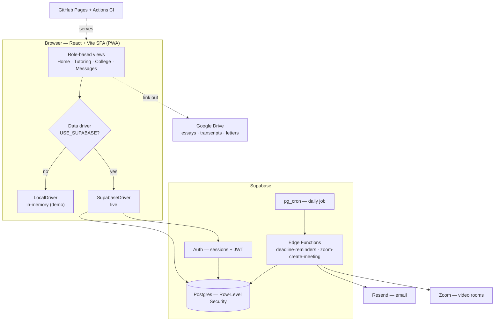
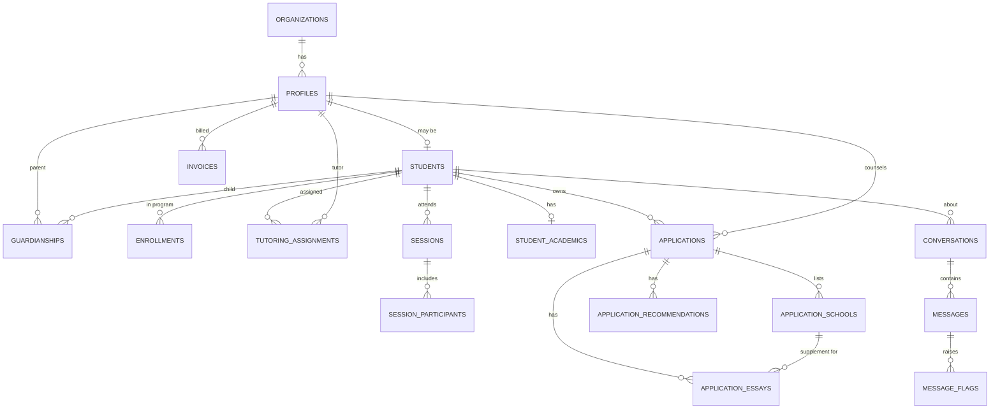
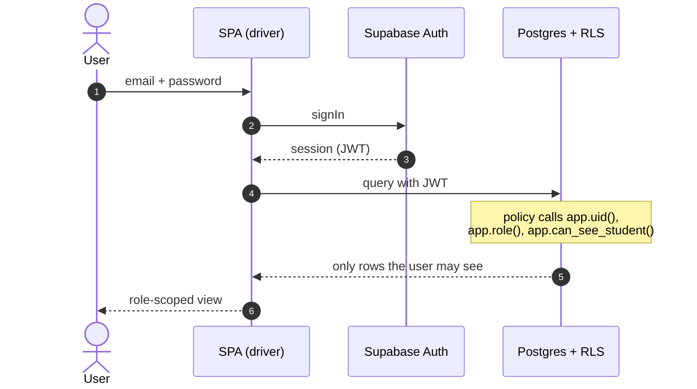
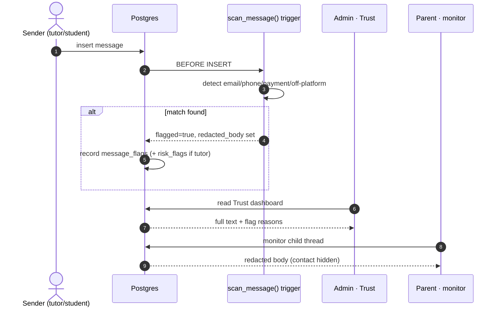
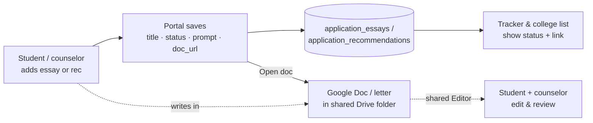
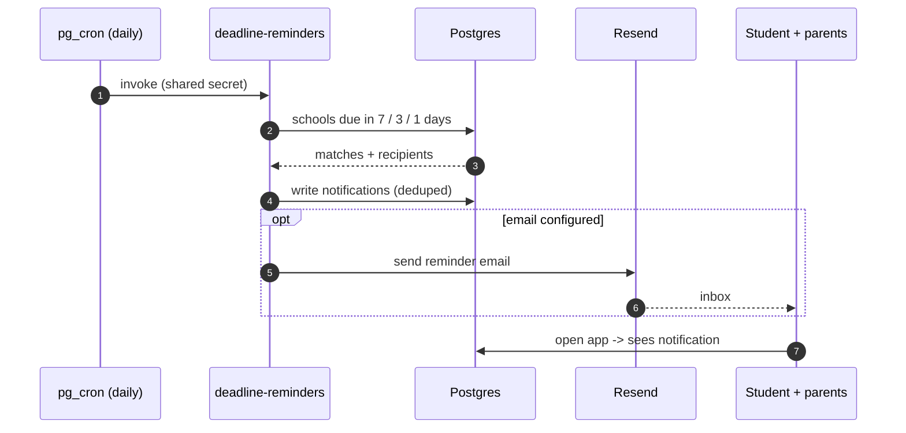

# Yakal Education Services — Portal Requirements & Data Flow

**Revision:** 2026-07-14 · Generated from the live codebase (`db/schema.sql`, migrations `001–019`, the data-layer drivers, and CI).

A single connected portal for two programs — K-12 tutoring and college-admissions consulting — that keeps students, parents, tutors, and counselors in sync while enforcing privacy and on-platform safety at the database layer.

| | |
|---|---|
| **Roles** | 7 |
| **Programs** | 2 (tutoring, admissions) |
| **Tables** | 38 |
| **Frontend** | React + Vite SPA (PWA) |
| **Backend** | Supabase — Postgres + Row-Level Security, Auth, Edge Functions, pg_cron |
| **Hosting** | GitHub Pages + Actions CI |

---

## Contents

1. [System overview](#1-system-overview)
2. [Actors & roles](#2-actors--roles)
3. [Functional requirements](#3-functional-requirements)
4. [Non-functional requirements](#4-non-functional-requirements)
5. [Architecture](#5-architecture)
6. [Data model](#6-data-model)
7. [Data flows](#7-data-flows)
8. [Security & RLS model](#8-security--rls-model)
9. [Deployment & delivery](#9-deployment--delivery)
10. [Requirements traceability matrix](#10-requirements-traceability-matrix)

---

## 1. System overview

Yakal runs two distinct services that reinforce each other:

- **Tutoring & Enrichment** — 1-on-1, group, camps, bootcamps, and Math Labs; K-12 academics, test prep & STEM.
- **College Admissions Consulting** — Essentials / Premier / Elite; balanced school lists, per-school application tracking, essays, academics, and recommendations.

A student may be enrolled in either or both via the `enrollments` table. Every role sees a purpose-built portal, and parents can monitor everything about their child in one place.

> **Design principle:** the app holds structure and links; sensitive documents live in Google Drive. Essays, transcripts, and recommendation letters are referenced by URL — never stored in the app — keeping cost and data-exposure low.

---

## 2. Actors & roles

Access is role-based and, for staff, further scoped by program. Every capability is enforced by Row-Level Security in Postgres, not merely hidden in the UI.

| Role | Scope | Primary capabilities |
|---|---|---|
| **Student** | self | Own sessions, homework, progress; own college list, tracker, essays, academics & recommendations; own message threads. |
| **Parent** | their children | Read-only dashboard across children; monitor threads (even as non-participant); view progress, tracker & billing. |
| **Tutor** | assigned students | Today's schedule, roster, book/log sessions, homework & progress, earnings; messaging. |
| **Counselor** | assigned applicants | Guide college lists, tracker, essays, academics & recommendations for their applicants; messaging. |
| **Tutoring Admin** | tutoring program | Manage students, tutors, sessions & payouts within the tutoring program. |
| **Admissions Admin** | admissions program | Manage all admissions students' lists, trackers, essays, academics & recommendations. |
| **Super Admin** | org-wide | Full visibility: students, tutors, revenue/outstanding, Trust & Safety flags, all programs. |

Roles come from `app.user_role` plus program grants in `staff_programs`; the legacy `admin` role maps to super-admin. Navigation is defined per role in `App.jsx → NAV`.

---

## 3. Functional requirements

### Accounts & access
- **FR-A1** — Email/password sign-up with role + program selection; a profile row is auto-provisioned on first login.
- **FR-A2** — Sign-up in a program auto-enrolls the student in that program.
- **FR-A3** — Demo accounts for each role via an in-memory driver — no backend required.
- **FR-A4** — Role-based navigation & views; admins can preview the app as any role.

### Tutoring
- **FR-T1** — Book sessions: individual, group, camp, bootcamp, Math Lab; online or in-person.
- **FR-T2** — Group sessions carry multiple participants; optional video room via the Zoom edge function.
- **FR-T3** — Homework assign → submit → grade; progress snapshots drive per-subject bars.
- **FR-T4** — Tutor availability, roster, and earnings/payouts.

### College list & tracker
- **FR-C1** — College list grouped Dream / Target / Safety, with deadlines, cost, aid, fit & admit stats; compare mode and CSV export.
- **FR-C2** — Per-school tracker: requirements checklist (application, essays, recs, transcript, scores, FAFSA, CSS) + admission decision.
- **FR-C3** — Deadline reminders surface on the home screen and via notifications/email.

### Essays · academics · recommendations
- **FR-C4** — Essays: core (Common App) and per-school supplements, each with status, prompt, and a Google Doc link to edit & review.
- **FR-C5** — Academics: structured GPA / SAT / ACT / AP, plus transcript & Drive folder links.
- **FR-C6** — Recommendations: recommender, status (not requested → requested → received), and a Drive link to the letter.
- **FR-C7** — Student and counselor can both read & edit these; parents are read-only.

### Messaging & Trust & Safety
- **FR-M1** — On-platform threads tied optionally to a student; unread indicators via read-state.
- **FR-M2** — Every message is scanned for contact info & off-platform solicitation; matches are flagged and redacted for non-admins.
- **FR-M3** — Flags feed an admin Trust dashboard; tutors moving off-platform accrue risk flags.

### Parent monitoring & billing
- **FR-P1** — Family dashboard: children, upcoming sessions, deadlines soon, unread messages.
- **FR-P2** — Read-only child detail across tutoring & admissions, and thread monitoring.
- **FR-P3** — Billing view: invoices and payment history.

### Admin & notifications
- **FR-D1** — Admin overview: active students, tutors, revenue, outstanding, open flags.
- **FR-D2** — In-app notifications with unread badge and read-state.
- **FR-D3** — Daily deadline-reminder job (pg_cron) writes notifications and sends email when configured.

---

## 4. Non-functional requirements

- **NFR-S · Security** — Row-Level Security on **every** table; `SECURITY DEFINER` helper predicates; least-privilege write policies; program scoping so tutoring data never leaks into admissions and vice-versa.
- **NFR-P · Privacy** — Contact info auto-redacted in messages; a `pii_access_log` records reveals; essays, transcripts & letters are kept in Google Drive and referenced by link, never stored.
- **NFR-A · Availability & deploy** — Static SPA on GitHub Pages (CDN); managed Supabase backend; CI with a 3-attempt deploy retry.
- **NFR-D · Demo / offline mode** — A `LocalDriver` mirrors the live data layer in memory so the whole app runs with no backend — used for demos and access-control tests.
- **NFR-E · Performance** — Single-file data layer; related reads batched with `Promise.all`; indexed foreign keys; mobile-first PWA payload.
- **NFR-M · Maintainability** — Numbered, idempotent SQL migrations; strict parity between the two drivers; an end-to-end suite asserting the access-control guarantees.

---

## 5. Architecture

A static React SPA talks to Supabase through a swappable data driver. The same UI runs against an in-memory driver (demo) or the live Supabase driver — the interface is identical.

---

## 6. Data model

38 tables organized into seven domains. The identity core (`organizations → profiles → students`) anchors every other table; guardianships and assignments define who may see whom.

| Domain | Tables |
|---|---|
| **Identity** | `organizations` · `profiles` · `students` · `guardianships` |
| **Staff & enrollment** | `tutor_profiles` · `tutor_subjects` · `tutoring_assignments` · `staff_programs` · `enrollments` |
| **Tutoring** | `subjects` · `sessions` · `session_participants` · `session_notes` · `homework` · `progress_snapshots` |
| **Admissions** | `applications` · `application_schools` · `application_essays` · `application_tasks` · `application_recommendations` · `student_academics` · `service_packages` |
| **Messaging** | `conversations` · `conversation_participants` · `conversation_reads` · `messages` · `message_flags` · `risk_flags` |
| **Billing** | `invoices` · `invoice_items` · `payouts` · `payout_items` |
| **Platform** | `notifications` · `attachments` · `app_settings` · `feature_flags` · `audit_log` · `pii_access_log` |

---

## 7. Data flows

### 7.1 · Authentication & the RLS security context

Every request carries the user's JWT. Policies resolve identity through `app.uid()` and gate rows through one central predicate, `app.can_see_student()`.

### 7.2 · Messaging with anti-disintermediation

The message scanner is a database trigger, so it cannot be bypassed by the client. Contact details and off-platform solicitations are flagged and hidden from members while remaining visible to admins for review.

### 7.3 · College essay & recommendation via Google Drive

The app stores structure and a link; the document lives in the family's shared Drive folder. Both student and counselor edit the same Doc; the portal tracks status.

### 7.4 · Deadline reminders (scheduled job)

A daily cron job scans upcoming application deadlines and notifies the student and their parents in-app, plus email when a provider is configured.

---

## 8. Security & RLS model

The UI hides what a role shouldn't see; Postgres **guarantees** it. Reusable `SECURITY DEFINER` predicates compose into every table policy, so authorization is defined once and applied everywhere.

| Predicate | Answers |
|---|---|
| `app.uid()` / `app.role()` | Who is the caller and what is their role? |
| `app.can_see_student(s)` | Central read gate: super-admin, the student, a parent, an assigned tutor, the counselor, or the program admin. |
| `app.is_parent_of(s)` | Enables parent monitoring of a child's threads & records. |
| `app.is_counselor_of(s)` | Grants a counselor read+write on their applicant's admissions data. |
| `app.is_program_admin(p)` | Scopes an admin to the tutoring or admissions program only. |
| `app.my_student_id()` | Maps a student login to their own record for self-access. |

Write policies follow a least-privilege pattern — e.g. admissions rows are writable only by *the student · their counselor · an admissions admin · super-admin*, while parents stay read-only. The message scanner and PII access log add a monitoring layer on top of these access rules.

---

## 9. Deployment & delivery

- **Frontend** — Vite builds a static bundle; GitHub Actions publishes to GitHub Pages on push to `main`, with a 3-attempt retry on transient failures.
- **Database** — Numbered SQL migrations (idempotent) applied in the Supabase SQL editor; a baseline `schema.sql` plus incremental `001…019`.
- **Backend jobs** — Edge Functions (Deno) for reminders & video rooms; secrets in Supabase Vault; scheduled via pg_cron + `pg_net`.
- **Quality gates** — An end-to-end access-control suite runs in CI, asserting parent monitoring, staff scoping, and message redaction before deploy.

---

## 10. Requirements traceability matrix

Each functional requirement mapped to the tables that store it, the data-layer driver methods that implement it (`app/src/db.js`), and the end-to-end tests that guard it (`test/e2e.test.mjs`).

| Req | Tables | Driver methods | Tests / verification |
|---|---|---|---|
| **FR-A1** | `profiles`, `students` | `signUp`, `signIn` | `handle_new_user` trigger provisions profile |
| **FR-A2** | `enrollments` | `signUp` | migration `009_auto_enroll` |
| **FR-A3** | *(in-memory)* | `LocalDriver`, `signInDemo` | all 13 e2e tests run on the demo driver |
| **FR-A4** | `staff_programs` | `me`, role `NAV` map | admin "switch view" preview |
| **FR-T1** | `sessions` | `bookSession`, `bookableStudents` | — |
| **FR-T2** | `session_participants` | `bookSession`, `ensureMeeting` | `zoom-create-meeting` edge fn |
| **FR-T3** | `homework`, `progress_snapshots` | `studentHome`, `toggleHomework`, `tutorStudents` | — |
| **FR-T4** | `tutor_profiles`, `payouts`, `payout_items` | `toggleAvailability`, `tutorEarnings`, `tutorHome` | — |
| **FR-C1** | `application_schools` | `collegeList`, `saveSchool`, `deleteSchool` | *college list returns essays; core vs supplement split* |
| **FR-C2** | `application_schools` *(requirements, decision)* | `applicationDetail`, `setSchoolTracking` | migration `013_app_tracking` |
| **FR-C3** | `application_schools`, `notifications` | `notifications`, `markNotificationsRead` | `deadline-reminders` edge fn |
| **FR-C4** | `application_essays` *(school_id, doc_url, prompt)* | `collegeList`, `applicationDetail`, `saveEssay`, `deleteEssay`, `setItemStatus` | *saveEssay adds a supplement…*; *college list returns essays…* |
| **FR-C5** | `student_academics` | `academics`, `saveAcademics` | *academics returns seeded scores…*; *parent can read child's academics* |
| **FR-C6** | `application_recommendations` | `applicationDetail`, `saveRec`, `deleteRec`, `setItemStatus` | *recommendations load; add, edit…*; *counselor sees the same recommendations* |
| **FR-C7** | *(RLS policies)* | `saveEssay`, `saveAcademics`, `saveRec` | *counselor sees…* + *parent read-only* tests |
| **FR-M1** | `conversations`, `conversation_participants`, `conversation_reads` | `conversations`, `messages`, `markConversationRead` | — |
| **FR-M2** | `messages`, `message_flags` | `sendMessage`, `scan`, `redact` | *scanner flags phone…*; *scanner flags payment/emails*; *redact strips contact info*; *flagged message is redacted* |
| **FR-M3** | `message_flags`, `risk_flags` | `adminFlags`, `tutorRisk` | `scan_message` + `record_message_flags` triggers |
| **FR-P1** | *(aggregate)* | `parentOverview` | — |
| **FR-P2** | `guardianships`, `conversations` | `parentChildren`, `childOverview`, `conversations` | *parent monitors a thread…*; *unrelated parent cannot see…* |
| **FR-P3** | `invoices`, `invoice_items` | `parentBilling` | — |
| **FR-D1** | *(aggregate)* | `adminOverview`, `listStudents`, `listTutors` | *admin sees all students, tutor scoped, student self* |
| **FR-D2** | `notifications` | `notifications`, `markNotificationsRead` | migration `015_notifications_rw` |
| **FR-D3** | `notifications`, `application_schools` | *(server-side)* | `deadline-reminders` fn + migration `014_deadline_cron` |

---

*Yakal Education Services — Requirements & Data Flow · generated from the live codebase. Diagrams are logical, not physical; table counts reflect `db/schema.sql` plus applied migrations `001–019`.*
