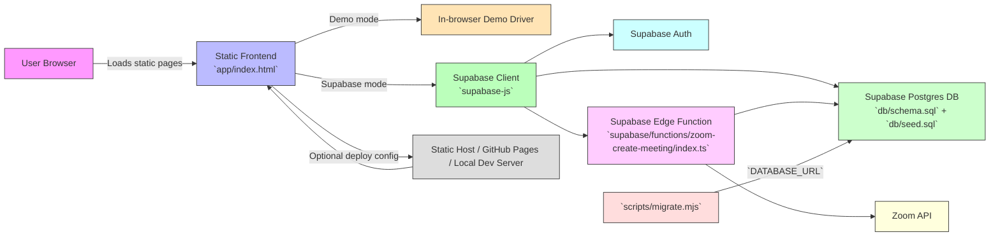

# Yakal Portal Architecture

This document describes the current architecture of the Yakal Portal app as shipped in this repo.

## Architecture overview

The app is a static frontend with two runtime modes:

- **Demo mode**: runs entirely in the browser with seeded demo data.
- **Supabase mode**: connects to Supabase Auth + Postgres and uses Row-Level Security for access control.

The repo also includes:

- a Node migration script for applying `db/schema.sql` and `db/seed.sql`
- a Supabase Edge Function for secure Zoom meeting creation

---

## Component diagram

---

## Detailed architecture

### Static frontend

- `app/index.html` is the single-page static application.
- It contains the UI, demo driver, and Supabase driver logic.
- When configured with a Supabase URL and anon key, the app uses `supabase-js` to talk to the backend.

### Supabase backend

- **Auth** handles sign-in, session management, and user identity.
- **Postgres** stores core data and enforces access rules with Row-Level Security.
- The database schema is defined in `db/schema.sql`.
- Demo and production seed data live in `db/seed.sql`.

### Edge function

- `supabase/functions/zoom-create-meeting/index.ts` runs on the Supabase Edge Function platform.
- It keeps Zoom secrets off the client and creates managed Zoom meetings for sessions.
- It verifies the caller, reads session/tutor data from Postgres, calls Zoom, and writes the join URL back to the session row.

### Local tooling

- `scripts/migrate.mjs` connects to a Postgres database using `DATABASE_URL`.
- It applies `schema.sql` and optionally `seed.sql`.
- This script is used for local development and Supabase project setup.

### Deployment and hosting

- The static app can be served locally with `npx serve app` or deployed to any static host.
- The repo is designed to be deployable to GitHub Pages as a demo site.
- A live Supabase backend is activated by adding the Supabase project URL and anon key into `app/index.html`.

---

## Runtime flows

### Demo runtime

1. Browser loads `app/index.html`.
2. The app enters demo mode because no Supabase keys are configured.
3. In-browser demo driver provides sample data and UI state.

### Supabase runtime

1. Browser loads `app/index.html`.
2. The app reads Supabase project configuration from the page constants.
3. The app initializes `supabase-js`.
4. Auth requests go to Supabase Auth.
5. Data requests go to Postgres.
6. Sensitive operations like Zoom meeting creation go through the Edge Function.

### Database provisioning

1. `scripts/migrate.mjs` connects to the target database.
2. It applies `db/schema.sql`.
3. If `--seed` is provided, it also applies `db/seed.sql`.

---

## Notes

- The current architecture is intentionally serverless/static-first.
- There is no Express or traditional Node web server in the current app.
- Supabase is the backend platform for auth, database, edge functions, and secrets.
